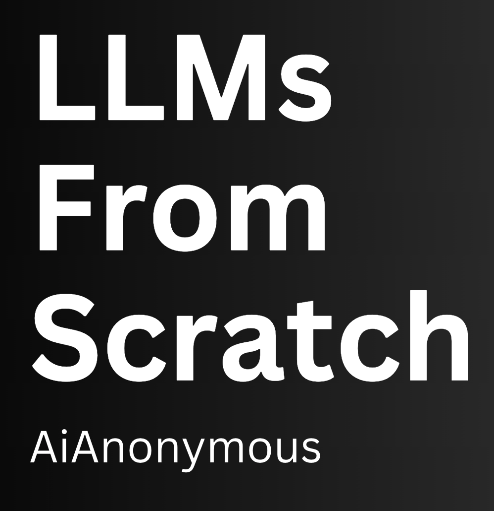

 

## Overview
*"What I cannot create, I do not understand." Richard P. Feynman*

### What
This is a hands-on, collaborative learning bootcamp focusing on Large Language Models (LLMs) spanning several months. 

Participants will learn to design, pretrain, and fine-tune a custom GPT-like model. The objective is to acquire a thorough understanding of GPT's architecture and mechanisms. This will provide a solid foundation for advanced topics and applications with LLMs.

### Why
Have you used LLMs but remain curious/dubious about how they work?
You want to learn about LLMs but find it overwhelming?
You recognize the potentials of LLMs but don't know where to start?

*Join us to build your LLM from scratch!* Learn by doing, with a supportive community.

### Who
The program is suitable for people with a quantitative background, such as programming, engineering, empirical science, etc. 

Two main prerequisites are: be comfortable with computers & maths; and willing to commit ~40h/month to focused learning.

### How
- Study: read/watch materials, run the code, and solve the exercises
- Research: read papers, explore and experiment, try to break things
- Group meeting: once every 4 weeks to summarize key ideas, review code, Q&A
- Discord: discuss about anything, share resources, ask questions

 

## Program & Schedule 

We plan to meet every 3/4 weeks, around the last week of the month.
- Month 0 [Getting started](Meeting-0/README.md) - Mon, Nov 4
  - intro to key concepts of LLMs, setup workflow, Python/Machine Learning warm-up.
- Month 1 [Tokenization & Embeddings](Meeting-1/README.md) - Mon, Nov 25
  - working with text data, basics of NLP, Pytorch/Deep Learning fundamentals
- Month 2 [Project: build your own tokenizer](Meeting-2/README.md) - Mon, Jan 6
  - build your GPT-2 tokenizer from scratch
- Month 3 [Attention Mechanisms](Meeting-3/README.md) - Mon, Jan 27
  - understanding multi-head self-attention and its critical role in Transformers
- Month 4 [Transformer & GPT Architecture](Meeting-4/README.md) - Mon, Feb 24
  - build GPT architecture in Pytorch, understand the inner works of Transformers
- Month 5 [Pretraining LLMs](Meeting-5/README.md) - Mon, Mar 24
  - large-scale pretraining on unlabeled data, and training strategies
- Month 6 [Fine-tuning LLMs](Meeting-6/README.md) - Mon, Apr 21
  - customize your LLM with fine-tuning, efficient fine-tuning, and instruction fine-tuning
- Month 7 [Final Project: build your own GPT-2](Meeting-7/README.md) - Mon, May 26
  - build and fine-tune your LLM for your use-case, showcase projects, share insights

 

We work with curated resources, most of which are publicly available. 

However, the backbone is the book: [*Build a Large Language Model From Scratch*, by Sebastian Raschka](https://www.manning.com/books/build-a-large-language-model-from-scratch), and the accompanying [Github repo](https://github.com/rasbt/LLMs-from-scratch). It's recommended that you get a copy for yourself.

The first 3 months have optional materials allowing for everyone to acquire the fundamental knowledge required to build LLMs.

 

### Milestones
1) Build a working BPE tokenizer from scratch
2) Build your Transformer architecture with multi-head self-attention
3) Pre-train and fine-tune an LLM, based on your own dataset and hardware.
4) Build your own GPT-2, fine-tune it for your usecase

 

### Logistics
- meetings are in-person in Lisbon (possible with remote participation)
- location & time are announced in Discord & Meetup
- materials will be uploaded in this repo