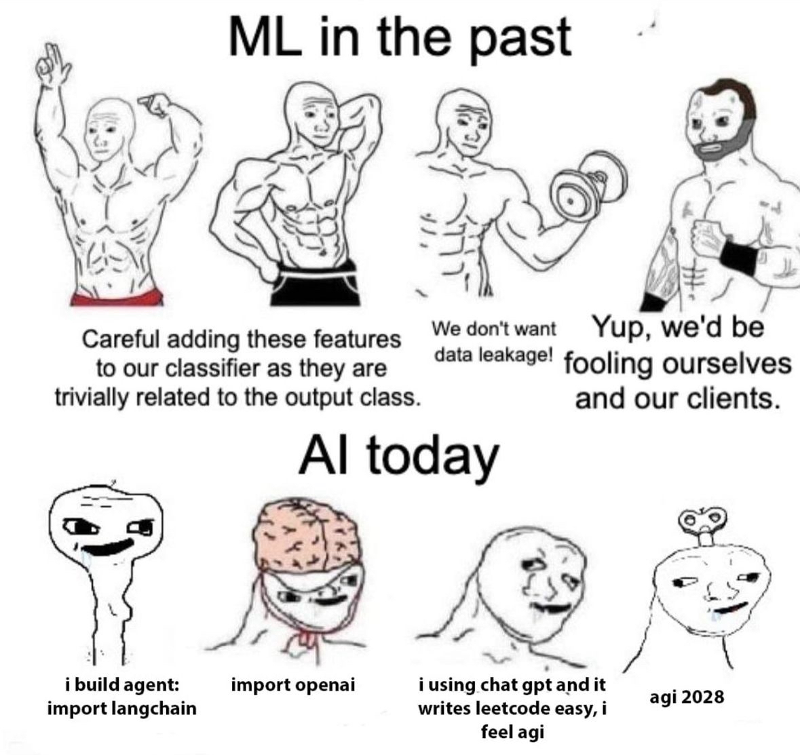

# COURSE: LLMs From Scratch

 

***Don't let this be you!***
 

### Course Overview
- Do you use LLMs as part of your work flow but have yet to dive into the interworkings of these models? 
- Are you looking for a structured learning approach combined with a peer support group? 

Same for us - that's why we created this course.

## Course Topics
- Tokenization
- Embeddings
- Transformers / Attention Mechanisms
- Pre-Training LLMs
- Fine-tuning LLMs

### Objectives
The goal of this course is that each participant leaves with a granular understanding and ability to manipulate LLMs from architecture design to fine-tuning. We view this as a foundational building block for further research into advanced topics and/or building applications with LLMs.

### Format
- There is no teacher for this course, rather this is a group study of carefully selected materials. 
- We will meet once a month in a casual interactive setting to discuss the materials, answer questions, and work on exercises together. We will also use Discourse to keep the conversation going in real-time.

### Book [required]
We will be working through a number of resources, most of which are freely available online. However we will be relying heavily on the following required text: 
- "Build a Large Language Model (From Scratch)" by Sebastian Raschka
- Available as PDF, EPUB https://www.manning.com/books/build-a-large-language-model-from-scratch
- Discount code: SRLLM24
- Full code repo: https://github.com/rasbt/LLMs-from-scratch

### Activites
- Reading: Read = read, run the code, and attempt the exercises
- Co-work: deliberate practice, debug, try to break things
- Group: Monthly meetings to summarize key insights, review code together, Q&A (each meeting someone will volunteer to present)
- Discord: chat about any questions/issues/discoveries

### Projects
1) Build a working BPE tokenizer from scratch
2) Experiment with your own custom transformer block with multi-head self attention
3) Pre-train and fine-tune a 1.5B parameter LLM on a publicly available dataset
4) FINAL: Build GPT-2 entirely from scratch, fine-tune for your own usecase 

## Proposed Schedule [*Needs to be updated from Notion*]

Proposed Dates

- Meeting 0 [Intro] - Monday Oct 28
- Meeting 1 [Tokenization & Embeddings] - Monday Nov 18
- Meeting 2 [Transformers & Attention] - Monday Dec 16
- Meeting 3 [LLM Architecture] - Monday Jan 20
- Meeting 4 [Pre-training] - Monday Feb 20
- Meeting 5 [Fine-tuning] - Monday Mar 17
- Meeting 6 [Project Showcase] - Wed Apr 2

## [Meeting 0 (Oct 2024): Introduction and Setup](Meeting-0/README.md)
Materials
- [Beginners] Intro to [LLMs Karpathy video](https://www.youtube.com/watch?v=zjkBMFhNj_g&t=1s&ab_channel=AndrejKarpathy)
- [Beginners] Python [online course](https://programming-24.mooc.fi/part-1/1-getting-started)
- [Beginners] [Kaggle ML learning modules](https://www.kaggle.com/learn) (first 6 modules)
- [Beginners] [Deep Learning Fundamentals](https://lightning.ai/courses/deep-learning-fundamentals/): Modules 1-3
- [Beginners] Course Text Book: Appendix A: Intro to Pytorch
- [All] Google [crash course: What are LLMs](https://developers.google.com/machine-learning/crash-course/llm)
- [All] Read: Chapter 1 of the Book
- [BONUS] LLM-Workshop-2024: [Overview of the Course Textbook in 3 Hours](https://github.com/rasbt/LLM-workshop-2024)

Estimate workload:

- [Beginners] about 20h [Python], 10h [ML] , 10h [PyTorch]
- [All] 5h

## Month 2: Nov 2024
Materials

- Chapter 2 Working with Text Data : read and code
- From NLP to token prediction - [a brief history](https://www.wwt.com/blog/a-brief-history-of-nlp)
- Watch [Karpathy's video on training a BPE](https://youtube.com/watch?v=zduSFxRajkE) tokenizer from scratch - Do the Colab notebook.

PROJECT: Build a working BPE tokenizer from scratch

Estimate workload: 10-20h

## Month 3 : Dec 2024

Materials

- Watch
    - [Stanford CS25: Karpathy on Transformers](https://www.youtube.com/watch?v=XfpMkf4rD6E&ab_channel=StanfordOnline)
    - [Stanford CS224N NLP with Deep Learning | 2023 | Lecture 8 - Self-Attention and Transformers](https://www.youtube.com/watch?v=LWMzyfvuehA&list=PLoROMvodv4rMFqRtEuo6SGjY4XbRIVRd4&index=9)
- Read
    - Chapter 3 on Attention mechanism: read and code
    - “Attention Is All You Need” ([paper](https://arxiv.org/abs/1706.03762), [discussion](https://www.oxen.ai/blog/arxiv-dives-attention-is-all-you-need))
    - “A Mathematical Framework for Transformer Circuits” ([paper](https://transformer-circuits.pub/2021/framework/index.html), [discussion 1](https://www.oxen.ai/blog/arxiv-dives-a-mathematical-framework-for-transformer-circuits), [discussion 2](https://www.oxen.ai/blog/arxiv-dives-a-mathematical-framework-for-transformer-circuits-part-two))
- Bonus: [Vision Transformers](https://www.oxen.ai/blog/arxiv-dives-vision-transformers-vit)

PROJECT: Code your own Transformer block with multi-head self attention

## Month 4 : Jan 2024

Materials: 

- Chapter 4 on implementing the model architecture (everything besides tokenization and transformers)
- Read: [How Mistral 7b Works](https://www.oxen.ai/blog/arxiv-dive-how-to-mistral-7b-works)

CATCH-UP: Be sure to finish the BPE and Transformer projects and prior learning materials.

## Month 5 : Feb 2025

Materials

- Read Chapter 5 on Pre-training the LLM
- Read Appendix E on adding additional bells and whistles to the training loop.
- Watch: [Stanford CS224N NLP with Deep Learning | 2023 | Lecture 9 - Pretraining](https://www.youtube.com/watch?v=DGfCRXuNA2w)

PROJECT: Find a GPU and pre-train the example model

## Month 6 : Mar 2025

Reading:

- Read Chapters 6 and 7 on fine-tuning the LLM.
- Read Appendix E on parameter-efficient fine-tuning with LoRA.
- Read [“New Training Paradigms”](https://magazine.sebastianraschka.com/p/new-llm-pre-training-and-post-training)
- Bonus: [Fine-tune your own Vision Transformer](https://www.oxen.ai/blog/practical-ml-dive-how-to-customize-a-vision-transformer-on-your-own-data)

PROJECT: Fine-tune the example model

## Month 7 : Apr 2025

FINAL PROJECT: Build your own GPT2

- Implement all elements of GPT2 from scratch
- Pre-train the model, then fine-tune to a specific use case
- Resources: [Karparthy Lets Reproduce GPT2](https://www.youtube.com/watch?v=l8pRSuU81PU&list=PLAqhIrjkxbuWI23v9cThsA9GvCAUhRvKZ&index=10)
